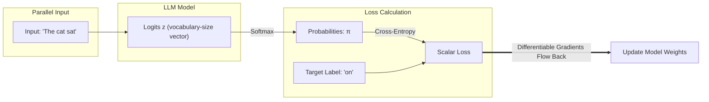
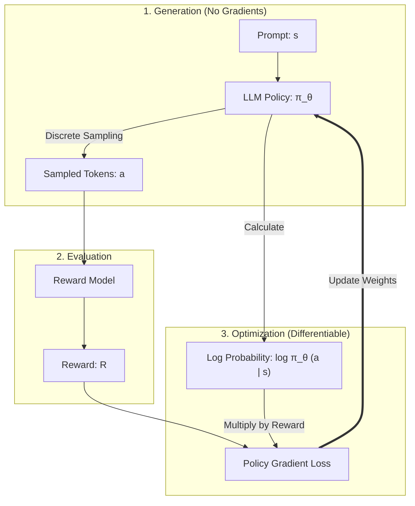

# Demystifying LLM Sampling and Training: From Teacher Forcing to RLHF

In modern Deep Learning, understanding the difference between how Large Language Models (LLMs) are **trained** and how they **generate text (sample)** is a common point of confusion. 

While Reinforcement Learning (RL) agents (like MADDPG) often need differentiable samplers like Gumbel-Softmax to train, LLMs use completely different paradigms. This article breaks down the mechanics of LLM training, inference sampling, and Reinforcement Learning from Human Feedback (RLHF).

---

## 1. Supervised Training: Pre-training & SFT (Teacher Forcing)

During Pre-training (learning from raw internet text) and Supervised Fine-Tuning (SFT, learning to answer questions from dataset templates), **LLMs do not sample tokens.** 

Instead, they use a technique called **Teacher Forcing**.

### How Teacher Forcing Works
Rather than generating words step-by-step and feeding its own predictions back as input, the model is fed the **entire ground-truth target sentence** all at once.

Consider the training sentence: `"The cat sat on the mat"`

1. **Parallel Forward Pass**: The LLM receives the input sequence: `["The", "cat", "sat", "on", "the"]` and processes all tokens in parallel (thanks to causal self-attention masking).
2. **Logit Output**: At each position, the model outputs a set of logits over the vocabulary (representing the predicted next token):
   * Given `"The"`, it predicts logits for the next word (target: `"cat"`).
   * Given `"The cat"`, it predicts logits for the next word (target: `"sat"`).
   * Given `"The cat sat"`, it predicts logits for the next word (target: `"on"`).
3. **Loss Computation**: For each position, the raw logits are passed through a standard Cross-Entropy loss against the **actual ground-truth target token**. 
4. **Gradient Flow**: Gradients flow directly from the loss function, through the Softmax formula, back into the model's weights.



### Why we don't need a Gumbel-Softmax here:
Because the target label (`"on"`) is a fixed, constant index from our training dataset, we do not sample anything. We simply evaluate the probability that the model assigned to that fixed index. Since no sampling step exists in the computation graph, the entire training pipeline is natively differentiable.

---

## 2. Inference & Generation: Autoregressive Sampling

Once the model is trained and we ask it a question, we enter the **inference phase**. Now, the model *must* generate text step-by-step. This is an **autoregressive loop**.

```
[Prompt] ---> Predict Token 1 ---> [Prompt + Token 1] ---> Predict Token 2 ---> ...
```

During this generation phase, we do **not** need to backpropagate gradients (the model's weights are frozen). Therefore, differentiability is not required, and we can use standard random sampling.

### The Autoregressive Logits Pipeline:
Assume the model is generating the word after `"The cat sat"`. The vocabulary contains three words: `["on", "under", "happily"]`.

1. **Raw Logits ($z$)**: The model outputs $z = [6.0, 4.0, 1.0]$.
2. **Temperature Scaling ($T$)**: We scale the logits by the user-defined temperature parameter $T$:
   $$z_{\text{scaled}} = \frac{z}{T}$$
   * **Low Temperature ($T = 0.1$)**: Logits become $[60.0, 40.0, 10.0]$. The difference is massive.
   * **High Temperature ($T = 2.0$)**: Logits become $[3.0, 2.0, 0.5]$. The difference is flattened.
3. **Softmax**: Convert scaled logits to probabilities:
   $$\pi_i = \text{softmax}(z_{\text{scaled}})_i$$
   * For $T=1.0$: $\pi \approx [0.87, 0.12, 0.01]$
   * For $T=0.1$: $\pi \approx [0.999..., 0.000..., 0.000...]$ (almost deterministic)
   * For $T=2.0$: $\pi \approx [0.68, 0.25, 0.07]$ (more creative/diverse)
4. **Sampling (Non-differentiable)**: The LLM draws a sample from the distribution $\pi$ (e.g., using `torch.multinomial` or a random number check against the CDF).
5. **Feedback Loop**: The chosen word is appended to the context window, and the model runs again to predict the next word.

---

## 3. Alignment Phase: RLHF & PPO (Reinforcement Learning)

Sometimes we want to train the LLM using a reinforcement learning objective (e.g., maximizing a reward score given by a human evaluator or a safety classifier). This is called **RLHF (Reinforcement Learning from Human Feedback)**, and is typically solved using **PPO (Proximal Policy Optimization)**.

### The Problem:
An LLM generates a full sentence, and a Reward Model gives it a single score (e.g., $+8.5$ for being helpful and safe). 
We want to update the LLM to get higher rewards. However:
* The sentence was generated by sampling discrete tokens autoregressively.
* You cannot backpropagate a reward gradient back through discrete token choices.

### How PPO Solves It:
Instead of trying to calculate gradients *through* the tokens, PPO treats the LLM as a **Policy** ($\pi_\theta$) and the token selections as **actions** ($a$). It uses the **Policy Gradient Theorem**:

$$\nabla_\theta J(\theta) = \mathbb{E} \left[ \nabla_\theta \log \pi_\theta(a \mid s) \cdot A \right]$$

where:
* $\pi_\theta(a \mid s)$ is the probability the LLM assigned to the generated token $a$ given the prompt context $s$.
* $A$ is the advantage (how much better the reward was compared to what we expected).



### The Optimization Step:
1. **Generate**: The model samples a sentence. This is non-differentiable, but we save the log-probabilities $\log \pi_\theta(a_t \mid s_t)$ that the model calculated for each token *during* generation.
2. **Evaluate**: The Reward Model scores the sentence.
3. **Train**: We pass the prompt through the LLM again to get the active graph. Instead of backpropagating through the tokens, we calculate the loss:
   $$\text{Loss} = - \log \pi_\theta(a \mid s) \cdot \text{Reward}$$
4. **Gradient Flow**: The gradient of the log-probability $\nabla_\theta \log \pi_\theta(a \mid s)$ is fully differentiable with respect to the model parameters $\theta$ (since the probability itself is just the output of a Softmax over the logits!). 
   * If the Reward is positive, the gradient pushes the model to make those exact token probabilities higher.
   * If the Reward is negative, it pushes the probabilities lower.

We never need to backpropagate through the discrete token choice itself—we only compute the derivative of the model's *willingness* (probability) to output that token!

---

## Summary Comparison

| Phase | Paradigm | Are Tokens Sampled? | Differentiable Sampling Needed? | Key Math / Loss Function |
| :--- | :--- | :--- | :--- | :--- |
| **SFT / Training** | Teacher Forcing | **No** (Tokens are fixed from dataset) | **No** | Cross-Entropy Loss |
| **Inference** | Autoregressive Loop | **Yes** (Generates text step-by-step) | **No** (Weights are frozen; no gradients) | $\text{softmax}(z/T) \to \text{Sample}$ |
| **RLHF / PPO** | Policy Gradient RL | **Yes** (Generates text to get reward) | **No** (Bypassed by optimizing log-probabilities) | $\text{Loss} = -\log \pi_\theta(a \mid s) \cdot \text{Reward}$ |
