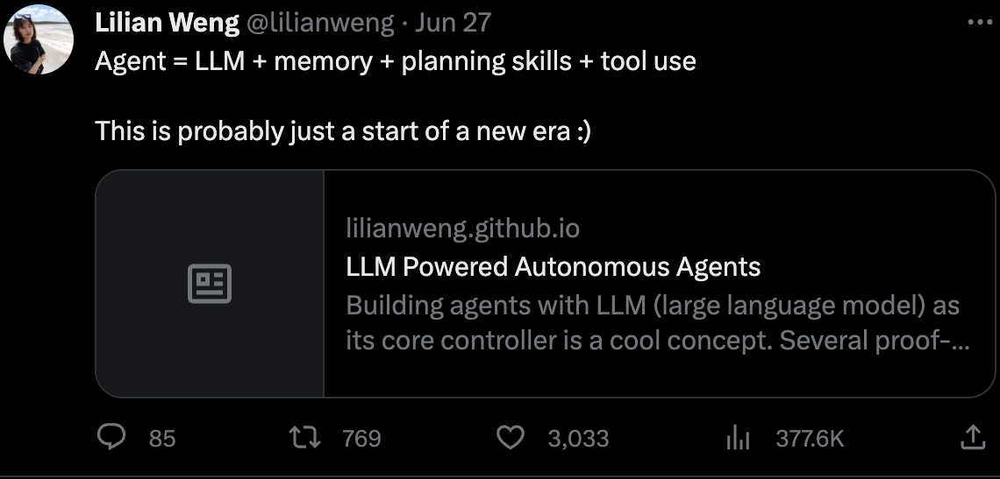
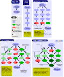
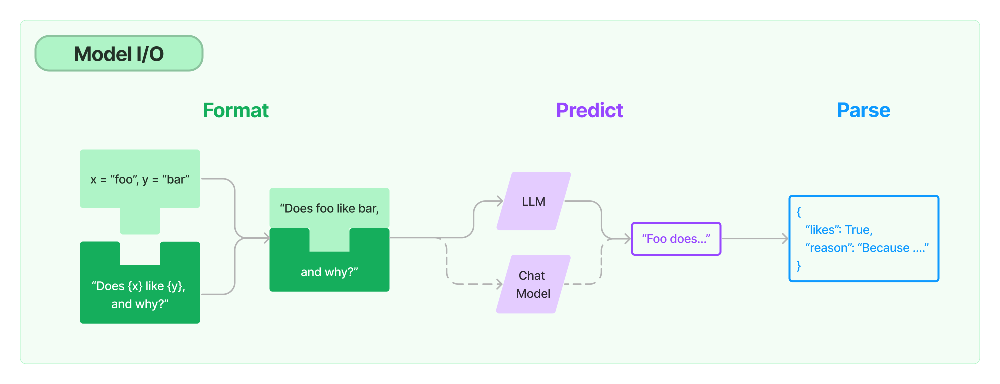
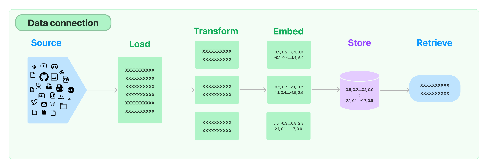
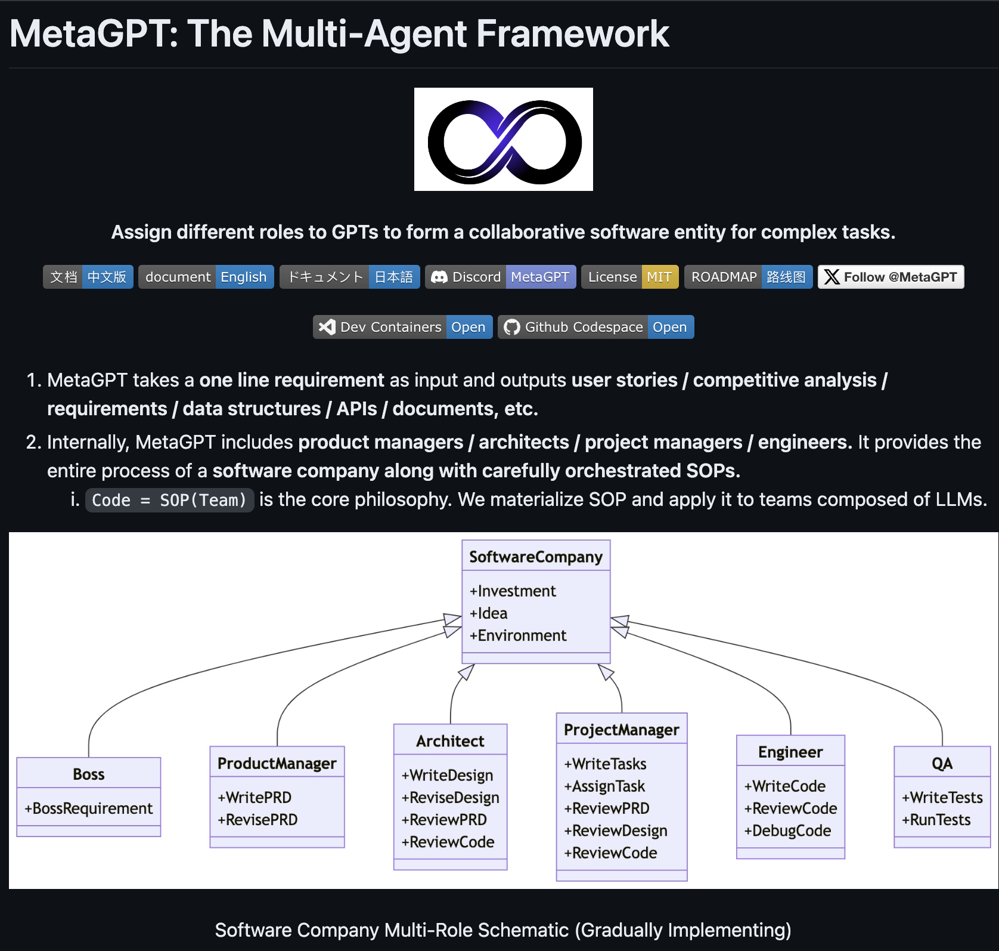

# Building Agentic Systems 🤖
From LLMs to Autonomous Agents

  Corentin Lallier

---
layout: section
---

# Augmented LLMs 🦜 + 🛠️

---
layout: default
---

# Connecting LLMs to external tools

 

<v-clicks>

  - **Computations**: delegate math to `calculators/interpreters` (computers excel at this).
  - **Fresh Information**: query `Google/Wikipedia` to resolve the "offline model" bottleneck.
  - **Latency**: retrieve `pre-computed` data instead of generating it.

</v-clicks>

 

<v-clicks>

> [!NOTE]
> - **Tools can be anything**: calculators, code sandboxes, headless web browsers, vector search engines (RAG), CLI, any database, REST APIs, MCP clients, another LLM or even other agents.
> - **Once executed**: tool results are then injected in the context

</v-clicks>

---
layout: two-cols-header
---

# Wait, what exactly is an agent? 🧠

::right::

<v-clicks>

An autonomous system, driven by a core LLM combined with key components:

</v-clicks>

<v-clicks>

- **LLM**: The brain (reasoning, decision making).
- **Planning**: Breaking down large tasks, reflecting on steps.
- **Memory**: Retaining historical data and contextual history.
- **Tools**: Performing actions on the environment.

</v-clicks>

::left::

---
layout: section
---

# Agentic systems 🤖

---
layout: default
---

# Planning
## ReAct (Reason & Act) Yao et al. (2022)

<AgentReact class="h-full max-h-60 w-full" />

<ul>

<li v-click="1"> <b>Thought</b>: The LLM reasons about the current state. </li>
<li v-click="2"> <b>Action</b>: The LLM decides to call a specific tool with args. </li>
<li v-click="4"> <b>Observation</b>: The execution output of the tool is fed back. </li>
<li v-click="5"> <b>Repeat until resolved.</b> </li>
<li v-click="5"> <b>Drawbacks</b>: Plan optimization depends solely on the LLM's raw reasoning capacity. </li>

</ul>

---
layout: two-cols-header
---

## Advanced Planning & Reflection

::left::

> [!IMPORTANT]
> - Token costs! Computation time!

::right::

Beyond linear loops, we can build structured thinking:

<v-clicks>

- **Chain of Thought (CoT)**: step-by-step breakdown.
- **Tree of Thoughts (ToT)** & **Graph of Thoughts (GoT)**: Explore multiple reasoning branches, backtracking when a branch fails.

</v-clicks>

<v-clicks>

- **Self-Reflection (Self-Correction)**:
  - An evaluator agent critiques the output of the actor agent.
  - Learns from trial-and-error by storing past mistakes in memory.

</v-clicks>

---
layout: default
---

# Memory Architectures

LLMs are stateless: to keep history of past conversations or document context, we need an external memory.

<MemoryDiagram class="h-full max-h-96 w-full" />

---
layout: default
---

# Memory Architectures

<v-clicks>

**Short-Term Memory**:
- In-context buffer inside the LLM prompt.
- Truncated or summarized via window buffers to respect context limits.

**Long-Term Memory**:
- External databases storing historical interactions or large documents.
- Retrieved semantically via **Vector Store** embedding queries.
- Can also store **skills** to use specific tools. 

</v-clicks>

---
layout: default
---

# Tools & Function Calling

For an agent to execute an action, it must output structured data (typically JSON) representing a function call.

**How models learn to generate tool usage**:
- **Toolformer** (Schick et al.): Pre-trained with special API tokens (e.g., `[Calculator(3+5) -> 8]`).
- **Gorilla** (Patil et al.): Specialized fine-tuning to select and call API endpoints from thousands of options.
- **JSON Mode**: Restricts LLM output to match a strict JSON schema.

---
layout: default
---

# Tools & Function Calling

<ToolcallsDiagram class="h-full max-h-100 w-full" />

---
layout: two-cols-header
---

# Orchestration: LangChain Abstractions

::left::

- **Model I/O**: Prompts, Chat models, and Output parsers.
- **Retrieval**: Document loaders, Text splitters, Embeddings, Vector stores.
- **Chains / Agents**: Building deterministic pipelines (Chains) or dynamic decision loops (Agents).

::right::

---
layout: two-cols-header
---

# Retrieval Strategies

::left::

Connecting documents to the LLM requires advanced retrieval techniques:

- **Contextual Compression**: Filtering irrelevant sentences to fit the context.
- **Ensemble Retriever**: Combining keyword search (BM25) with vector search (Hybrid Search).
- **Parent Document Retriever**: Storing small chunks for search but returning the larger parent context.

::right::

---
layout: two-cols-header
---

# Multi-Agent Systems & SOPs

::left::

Complex goals require dividing tasks among specialized sub-agents:

- **Role-playing**: Assigning distinct system prompts (e.g., "You are a Product Manager").
- **SOPs (Standard Operating Procedures)**: Structuring agent interactions (e.g., PM drafts specs -> Engineer writes code -> QA runs tests).
- **Frameworks**: MetaGPT, AutoGen.

::right::

---
layout: default
---

# Summary: Building Reliable Agents

1. **Define a strict loop**: Limit maximum iterations (e.g., max 5 loops) to prevent infinite loops and API billing surprises.
2. **Isolate Environment**: Run code interpreters and command line tools in secure, sandbox containers (Docker).
3. **Structured Outputs**: Enforce function calling schemas using tools like Pydantic.
4. **Log Intermediate Steps**: Always inspect intermediate prompt logs to analyze why agent planning failed.

---
layout: center
class: text-center
---

# Thanks! 🚀

 
 

<a href="/blog/presentations/" class="btn-blue">Back to Presentations</a>

