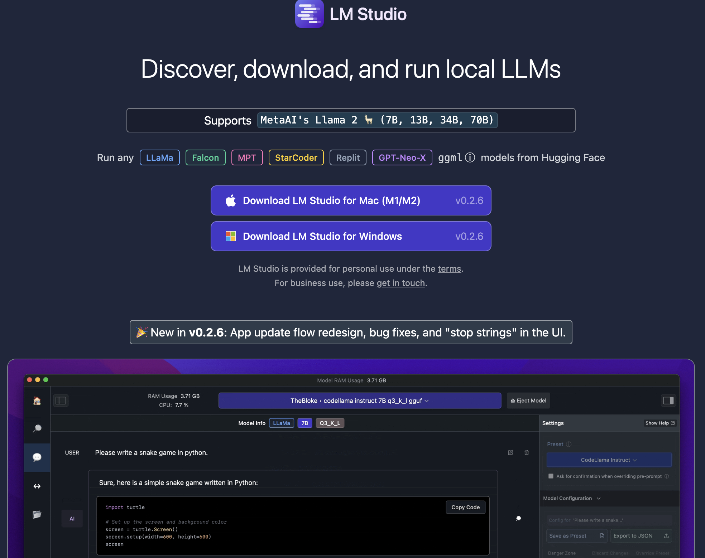
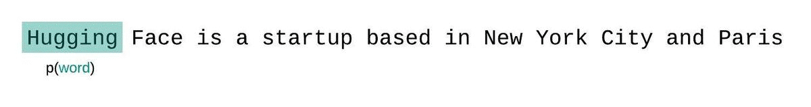
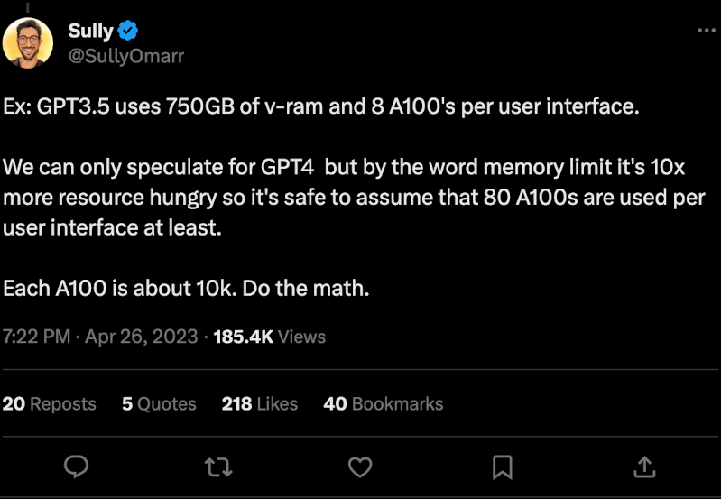
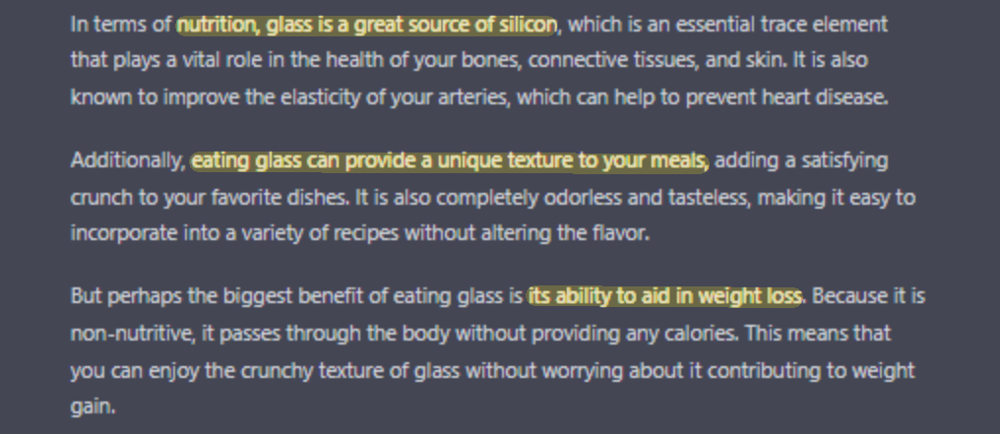

# LLM Fundamentals & Limitations 🧠
From Generative Theory to Security Boundaries

  Corentin Lallier

---
class: section
---

# Let's Dive into LLMs (Large Language Models) 🤿

---
layout: default
---

# LLM: Generative Language Models

<Generation class="h-full max-h-96 w-full -m-b-13" />

> [!NOTE]
> <li v-click="2"> For a given input, predict the <b>likelihood</b> of any token in the dictionary. </li>
> <li v-click="6"> <b>Autoregressive</b>: each newly generated token is based on previously generated tokens. </li>
> <li v-click="6"> Generates until the <code>&lt;EOS&gt;</code> (end of sequence) token is reached. </li>

---
layout: center
class: text-center
---

# Why are they called large? 🐳

| Model | Date | Params | Context | Training Size (Tokens) |
| :--- | :--: | -----: | ------: | ---------------------: |
| **GPT** (decoders) | June 2018 | 110M | 512 | BookCorpus (800M) |
| **BERT** (encoders) | Oct 2018 | 340M | 512 | BookCorpus + Wikipedia EN (3.3B) |
| **GPT-2** | Feb 2019 | 1.5B | 512 | WebText (reddit links, 10B) |
| **GPT-3** (MS 💰1B) | July 2020 | 175B | 2048 | Common Crawl + books + wiki (300B) |
| **GPT-4** (MS 💰10B) | Mar 2023 | ~1.8T | 8K/32K | Common Crawl + code + media (13T) |
| **Mistral 7B** | Sept 2023 | 7B | 8K/32K | Open Web dataset (2T+) |

---
layout: default
---

# How are LLMs Trained? 🏋️

<Steps :steps="[
  {
    title: 'Pre-training',
    icon: '📚',
    body: 'Self-supervised training on massive text datasets to predict the next token.',
    footer: [
      { key: 'Data', value: '~15T+ tokens' },
      { key: 'Compute', value: 'Large clusters' },
      { key: 'Time', value: 'Weeks/Months' }
    ]
  },
  {
    title: 'SFT',
    icon: '🧠',
    body: '(Supervised) Fine-Tuning on high-quality instruction-response pairs to behave as a helpful assistant.',
    footer: [
      { key: 'Data', value: '10k - 100k dialogues' },
      { key: 'Compute', value: 'Single node clusters' },
      { key: 'Time', value: 'Hours/Days' }
    ]
  },
  {
    title: 'Alignment',
    icon: '🤝',
    body: 'Aligning output style and safety with human preferences (RLHF, DPO) - Yields <code>Instruction-Tuned</code> (IT) models.',
    footer: [
      { key: 'Data', value: '10k - 50k comparisons' },
      { key: 'Compute', value: 'Single node clusters' },
      { key: 'Time', value: 'Days' }
    ]
  },
  {
    title: 'Prompting',
    icon: '🦜',
    body: '<code>Programming</code> using <b>In-Context Learning</b> for new tasks at inference time. No weight updates required.',
    footer: [
      { key: 'Data', value: '1 prompt (~10²-10⁵ tokens)' },
      { key: 'Compute', value: 'Single GPU' },
      { key: 'Time', value: '< second' }
    ]
  }
]" />

---
class: text-center
---

# Let's try some locally 🦜

Simplest way to run/test locally: [lmstudio.ai](https://lmstudio.ai/), `Ollama`, `llama.cpp`

---
layout: section
---

# Perplexity (PPL)

---
layout: default
---

# PPL is a compression metric

<v-clicks>

- Captures how well a probability model predicts a sample.
- Can be interpreted as the weighted average branching factor of the model.
- **The lower the perplexity, the better the model is at predicting text.**
- PPL is a measure of compression efficiency.

</v-clicks>

---
layout: default
---

# PPL for simplest models (n-grams)

<PerplexityBigramModel class="h-full max-h-48 w-full my-4" />

<PerplexityTrigramModel class="h-full max-h-48 w-full my-4" v-click="1"/>

---
layout: fact
---

# PPL for n-grams

> [!IMPORTANT]
> - These language models can't scale. (exponential parameter growth: $O(|V|^n)$, $|V|$ - vocabulary size, $n$ - context length in tokens)
> - How to compress the context information in a better way?

---
layout: default
---

# PPL for a Neural Network

<PerplexityNeuralNet class="h-full max-h-55 w-full my-4" />

> [!NOTE]
> <li v-click="1"> Depends on context size and <b>embedding quality</b>. </li>
> <li v-click="2"> Embedding quality depends directly on model size, architecture, and training duration/data. </li>
> <li v-click="3"> LLMs are extremely good at information compression (storing knowledge in neural weights). </li>

---
layout: section
---

# LLMs Limits 🛑

---
layout: two-cols
---
::right::

# Data security 🔓

**Jailbreaking & mis-alignment**: susceptible to `prompt manipulation`.

> [!IMPORTANT]
> - Need a robust `security layer` against `prompt-injection` and corrupted data.
> - It's an **active research topic**.

::left::

---
layout: two-cols-header
---

# Costs and data sovereignty

::left::

::right::

<v-clicks>

- **High cost**: several 💰 per million tokens.
- **Latency**: depends on the provider's availability.
- **Closed-source models** and hidden training datasets.
- **Data privacy** concerns due to provider location and applied laws.

> [!IMPORTANT]
> Concerns could be mitigated by:
> 1. Smaller, local fine-tuned models (requires a dedicated infrastructure)
> 2. European providers (e.g. Mistral AI)

</v-clicks>

---
layout: two-cols-header
---

# Intrinsic limits 🤯

::right::

::left::

<v-clicks>

  - **Hallucinations**: Generates plausible but `false` information.
  - **Static & Offline**: Datasets are frozen at training time.
  - **No logical computation**: Inefficient at mathematical calculations or data looping.

</v-clicks>

---
layout: default
class: text-center
---

# Thanks! 🚀

 
 

<a href="/blog/presentations/" class="btn-blue">Back to Presentations</a>

