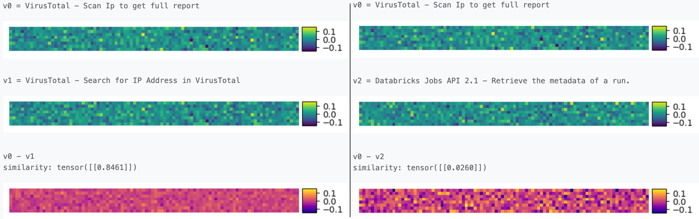
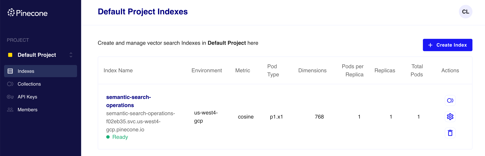

# RAG and Vector Search 101

An introduction to semantic and vector search

::div{.author-block}
Corentin Lallier
::

---
layout: center
class: plan-slide
---

# Plan

1. **What is RAG?** (Retrieval-Augmented Generation)
2. **Vector Search** vs. Keyword/Fuzzy Search
3. **Embeddings** & Sentence Transformers
4. **Vector Databases** & Simple Demo
5. Why RAG can fail? **Beyond** simple Vector Search: 
    - Sparse vs. Dense representations
    - Reranker: Bi-Encoder vs. Cross-Encoder
    - The Chunking Challenge

---
layout: section
---

# 1. What is RAG?

---
layout: two-cols-header
---

# Retrieval-Augmented Generation (RAG)

::left::

- **The LLM limitations:** LLMs lack private, real-time, or domain-specific context. They hallucinate when they don't know the answer.
- **The RAG Solution:**
  1. **Retrieve:** Find relevant context in an external database.
  2. **Augment:** Paste that context into the LLM prompt.
  3. **Generate:** Ask the LLM to answer using only the provided context.

::right::

**Concept Prompt:**

```yaml
Answer based ONLY on the context below:
------
Context:
- MS Teams: 'Create messages in a channel'
------
Question: How to write on Teams?
```

---
layout: section
---

# 2. Vector Search vs. Keyword/Fuzzy Search

---
layout: two-cols-header
---

# 2.1 Search 101

::left::

<QKV class="w-full rounded" />

::right::

For a search engine we need 3 functions:

- $f_1(x)$: A value to key function (often pre-computed)
- $f_2(x)$: A text to query function
- $f_3(x)$: A _"ranking"_ function

::div{.callout-amber.p-4.mt-10}
**A universal challenge:** Shared by Wikipedia, Google, Spotify, and any modern retrieval system.
::

---
layout: two-cols-header
---

# 2.2 Keyword and Fuzzy Search

::left::

<QKVInvertedIdx class="w-full rounded shadow" />

::right::

- **$f_1(x)$ (Index creation):** Extracts keywords/stems (tokenization) and calculates TF-IDF/BM25 weights to build the inverted index.
- **$f_2(x)$ (Query parsing):** Tokenizes the query text into terms.
- **$f_3(x)$ (Comparison & Ranking):** Computes match scores using exact keyword matching, Jaccard similarity, or Levenshtein distance (for fuzzy search).

::div{.callout-amber.p-4.mt-10}

**Limitations:** 
- Searching multiple words requires complex set union/intersection operations.
- **Language is complex:** synonyms, word variations (tense, gender, plural,...), polysemy, etc.

::

---
layout: two-cols-header
---

# 2.3 Vector Search

::left::

<QKVSemanticSearch class="w-full rounded shadow" />

::right::


- $f_1(x)$ and $f_2(x)$ are the **same**: a neural network that computes high-dimensional embeddings from strings.

::div{.callout-amber.p-4.mb-10} 
Don't worry! Will deep dive into this in the next section!
::

- $f_3(x)$ is a similarity function. 

The most used in practice is the **cosine similarity**:

$$ \text{similarity} = \cos(\theta) = \frac{\vec{A} \cdot \vec{B}}{\|\vec{A}\| \|\vec{B}\|} $$

---
layout: default
---

# 2.3 So far, (TL;DR) Vector Search + RAG Recipe:

1. Prepare your data:

::div{.callout-amber.p-4.mb-10}
 - Compute **embeddings** as keys for the documents.
 - Store (keys, documents) in a **vector database**.
::

2. At query time:

::div{.callout-amber.p-4.mb-10}
 - Query the database using **embeddings** of the question.
 - Compute the **similarity** between the query embedding and the document embeddings.
 - Return the top-k results ordered by similarity.
::

3. Augment the LLM context (RAG only):

::div{.callout-amber.p-4.mb-10}
 - Insert the top-k results in the LLM context for RAG.
::

---
layout: section
---

# 3. Embeddings & Sentence Transformers

---
layout: two-cols-header
---

# 3.1 What is an embedding?

::left::

- Feature vector **extracted** from a neural network model to **represent input data**.
- Can represent words, sentences, documents, images, etc.
- Captures relationships between input data (**representational learning**).

::div{.callout-amber.p-4.mb-10}

**Example:** VirusTotal - Scan IP to get report:

Vector representation:

```python
[[-7.5007e-03, 7.8518e-02, -4.0632e-02, -4.3306e-03, 3.3827e-02, ...]]
```

Image representation:


::

::right::

Embeddings in 3 mins:
::youtube{id="ulD7IsecPbU"}

---
layout: two-cols-header
---

# 3.1.1 Representational Learning: Example with Words

::left::

- Built with **Word2Vec** models: each vector (point) is a word embedding.
- **Closeness** $\rightarrow$ **similar embeddings** (semantic proximity $\rightarrow$ geometric proximity).
- Distance between points represents **similarity** and **relations**.
- They are **contextual**: meaning depends on the context.

::right::

{.w-full.rounded.shadow}


---
layout: default
---

# 3.1.2 Vector Similarities




---
layout: default
---

# 3.1.3 Interactive Similarity Graph

<iframe src="./similarities.html" class="w-full h-8/10 rounded shadow" />

Zoom/Pan/Interact with the Similarity Graph. 120 descriptions. Edges are drawn if similarity &gt; 0.78.
<a href="./similarities.html" target="_blank" class="btn-blue">Open fullscreen</a>

---
layout: two-cols-header
---

# 3.2 The Baseline: What is BERT?

::left:: 

- **Bidirectional Encoder Representations from Transformers** (_Devlin et al. Google, 2018_)
- **Seq2vec model:** English sentences $\rightarrow$ vector of 768 values.
- **Training Corpus:** **2.5B** words from Wikipedia + **0.8B** words from BooksCorpus.
- **Bidirectional:** uses both left and right context (context length: 512).
- **BERT Large:** 340M parameters, trained on 64 TPUs over 4 days.

::right::

In reality, a stack of models:
$$\text{Tokenizer} \rightarrow \text{WordPiece} \rightarrow \text{BERT}$$

```js 
// e.g. tokenizer
nltk.word_tokenize("At eight o'clock on Thursday morning 
                    Arthur didn't feel very good.")
// ['At', 'eight', "o'clock", 'on', 'Thursday',
//  'morning', 'Arthur', 'did', "n't", 'feel',
//  'very', 'good', '.']
```
<a href="https://huggingface.co/blog/bert-101" target="_blank" class="btn-blue mt-10">🤗 BERT 101 on Hugging Face</a>


---
layout: center
---

# 3.3 From BERT to Sentence Transformers


- **BERT Limitation:** Vanilla BERT yields poor sentence embeddings directly (requires fine-tuning or pooling).

- **Sentence Transformers (2019-Present):**
  - Fine-tuned using **Siamese network structures** specifically for semantic similarity tasks.
  - Example: `all-mpnet-base-v2`, `BGE`, `E5`, etc.

- **API-based Embeddings today:**
  - OpenAI (`text-embedding-3-small`), Cohere Embed, Voyage AI.
  - Return high-quality, dense vectors with minimal setup.


<a href="https://huggingface.co/sentence-transformers" target="_blank" class="btn-blue mt-10">
  🤗 Hugging Face Sentence Transformers
</a>

---
layout: section
---

# 4. Vector Databases & Simple Demo

---
layout: two-cols-header
---

# 4.1 Vector Databases & Pinecone

::left::

- **Store & Index:** High-dimensional embeddings.
- **Query & Similarity:** Compare query vectors using Cosine distance.
- **Retrieve:** Return top-k closest matches to augment LLM context.
- **Popular options**: `Pinecone`, `Qdrant`, `Milvus`, `ChromaDB`, `PGVector`, `Weaviate`.

::right::

Pinecone interface example:




---
layout: center
---

# 4.2 Demo

## Compute embeddings

```python
from sentence_transformers import SentenceTransformer

# load model
model = SentenceTransformer('BAAI/bge-base-en-v1.5')

# create a single embedding
embedding = model.encode([
  "Google Apigee API - Lists all developers in an organization"
], normalize_embeddings=True)
# embedding shape: [1, 768], value:
# [[-7.5007e-03,  7.8518e-02, -4.0632e-02, -4.3306e-03,  3.3827e-02,
#   -1.4586e-02,  6.2572e-02, -1.6180e-02,  6.8144e-02,  ...]]
```

---
layout: two-cols-header
---

# 4.2 Demo - Pinecone - Fill the DB

::left::

## 1. Create Index

```python
from pinecone import (
  Pinecone, ServerlessSpec
)
pc = Pinecone()

# create serverless index
pc.create_index(
  name='operations-id',
  dimension=768,
  metric='cosine',
  spec=ServerlessSpec(
    cloud='aws',
    region='us-east-1'
  )
)
```

::right::

## 2. Upsert Data

```python
index = pc.Index('operations-id')

# format: (id, vector, metadata)
vectors = [
  (
    op.id,
    op.embedding,
    {
      "service": op.serviceName,
      "description": op.description
    }
  )
  for op in operations
]
index.upsert(vectors=vectors)
```

---
layout: two-cols-header
---

# 4.2 Demo - Pinecone - Query against an embedding

::left::

## 3. Create the query embedding

```js
import { Pinecone } from
  "@pinecone-database/pinecone";

const pc = new Pinecone({
  apiKey: process.env.PINECONE_API_KEY
});
const index = pc.index("operations-id");

// embed search string
const vector = await getEmbedding(
  "Microsoft Teams - send a message"
);
```

::right::

## 4. Search & Response

```js
const response = await index.query({
  vector,
  topK: 3,
  includeMetadata: true,
});
// Results:
// 0.74: ('OPER-93a0', 'MS Teams', 'Send...')
// 0.69: ('OPER-9f59', 'MS Teams', 'Start...')
// 0.68: ('OPER-0d0e', 'MS Teams', 'Get...')
```

---
layout: section
---

# 5. Why RAG can fail? Beyond simple Vector Search

---
layout: two-cols-header
---

# 5.1 Dense vs. Sparse representations

::left::

- **Dense Vector Search:**
  - Represents concepts & synonyms (e.g. "how to write" $\rightarrow$ `create message`).
  - *Failure case:* Exact words, serial numbers, SKU IDs, or function names (e.g. `OPER-93a0`).

- **Sparse Lexical Search (BM25):**
  - Matches exact character sequences (TF-IDF based).
  - *Failure case:* Concepts variations and synonyms.
- **Hybrid Search:** Query both and merge results using **RRF (Reciprocal Rank Fusion)**.

::right::

::div{.callout-amber.p-4}

Hybrid Search (RRF):

$$ \text{Score}(d) = \sum_{m \in M} \frac{1}{k + r_m(d)} $$

::

For combining Lexical and Vector search:
$$ \text{Score}(d) = \frac{1}{60 + r_{\text{lexical}}(d)} + \frac{1}{60 + r_{\text{vector}}(d)} $$

Where:
- $M$: The set of search systems (here, Lexical and Vector).
- $r_m(d)$: The **rank** of document $d$ in system $m$ (1st, 2nd, etc.).
- $k = 60$: `Smoothing parameter`, a constant that prevents high ranks to dominate the score.


---
layout: two-cols-header
---

# 5.2 Bi-Encoder vs. Cross-Encoder

::left::

- **Bi-Encoder (Vector DB style):**
  - Computes query & document embeddings *independently*.
  - *Pros:* Fast and scalable - $O(1)$ query time using index search.
  - *Cons:* Lacks token-to-token attention.
  

- **Cross-Encoder (Reranker style):**
  - Processes query & document *together*.
  - *Pros:* Highly accurate - full self-attention across query & doc.
  - *Cons:* Extremely slow for database scale - $O(N)$.

::right::

::div{.callout-amber.p-1}

**Reranker Concept:**

`[Query + Doc]` $\rightarrow$ `[Transformer]` $\rightarrow$ `[Score]`
::

```python
from sentence_transformers import CrossEncoder

model = CrossEncoder("BAAI/bge-reranker-v2-m3")

query = "What is the capital of China?"
documents = [
    "The capital of China is Beijing.",
    "Gravity is a force that attracts two bodies...",
]

pairs = [(query, doc) for doc in documents]
scores = model.predict(pairs)
print(scores)  # [ 7.625 -11.375]

rankings = model.rank(query, documents)
```

---
layout: two-cols-header
---

# 5.3 The Chunking Challenge

::left::

- **Why do we chunk:**
  - LLMs have token limits (typically 4k - 128k tokens).
  - Embedding models too have token limits (typically 512 - 8192 tokens).
  - And long text dilutes semantic focus for embeddings.


- **Chunking parameters:**
  - **Chunk Size:** Small chunks (precise but lose context) vs. Large chunks (rich context but diluted representation).
  - **Overlap:** Repeating tokens between consecutive chunks to avoid cutting off key sentences.

::right::

::div{.callout-amber.p-4.mt-10}

**Strategies:**

- **Metadata-based:** Prepending metadata to chunks for better context.
- **Hierarchical chunking:** Keep "parent-chain" context from higher-level sections (titles, sub-titles, current section summary, etc. for each paragraph).
- **Semantic Chunking:** Detecting shifts in semantic similarity to split paragraphs dynamically.

::

---
layout: center
---

# Conclusion: The Production RAG Pipeline

1. **Preparation (Smart Chunking):** Split source text into chunks (Overlapping / Hierarchical / Semantic) to preserve context.

2. **Retrieval (Sparse + Dense Hybrid):** Combine **Vector Search** (conceptual intent) + **BM25** (exact matches) and merge with **RRF**.

3. **Reranking (Precision Filtering):** Pass top candidates through a **Cross-Encoder Reranker** to isolate the top-5 absolute best contexts.

4. **Generation (Context Augmentation):** Embed the top-5 passages into the LLM prompt context to generate more accurate answers.


---
layout: two-cols-header
---

# Resources & Further Reading

::left::

- **BERT:** [Research Paper](https://arxiv.org/abs/1810.04805) | [Official GitHub](https://github.com/google-research/bert)
- **Embeddings:** [Critique by Nils Reimers](https://medium.com/@nils_reimers/openai-gpt-3-text-embeddings-really-a-new-state-of-the-art-in-dense-text-embeddings-6571fe3ec9d9)
- **Sentence Transformers:** [Hugging Face ST Hub](https://huggingface.co/sentence-transformers)

::right::

**Embeddings for Everything**

Lecture by **Dan Gillick** (Google)

::youtube{id="JGHVJXP9NHw"}

Thanks!

