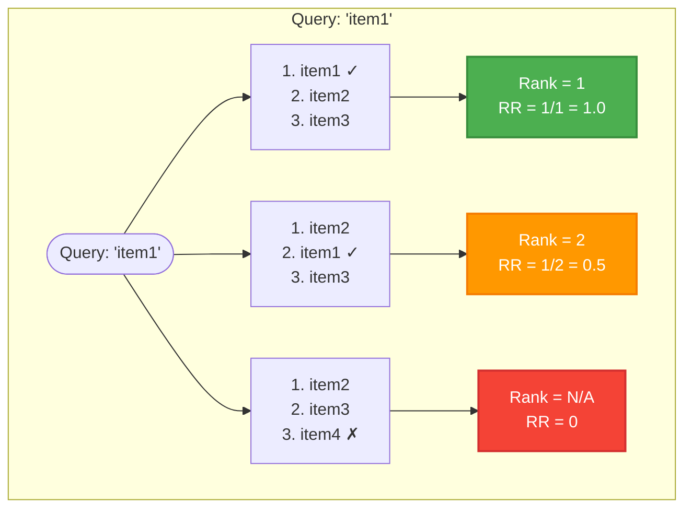
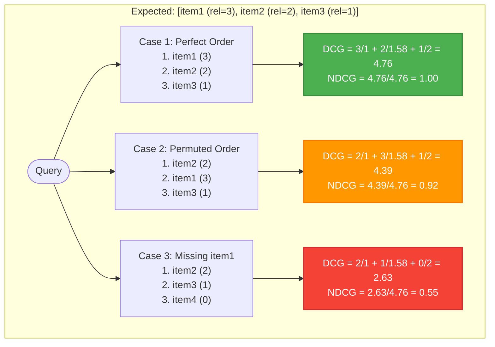
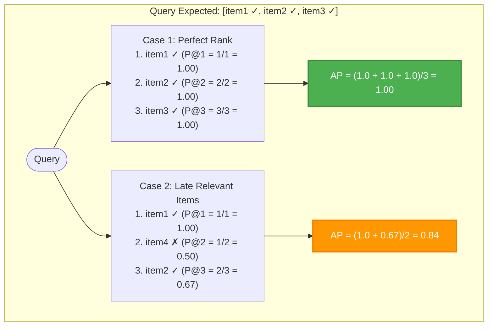
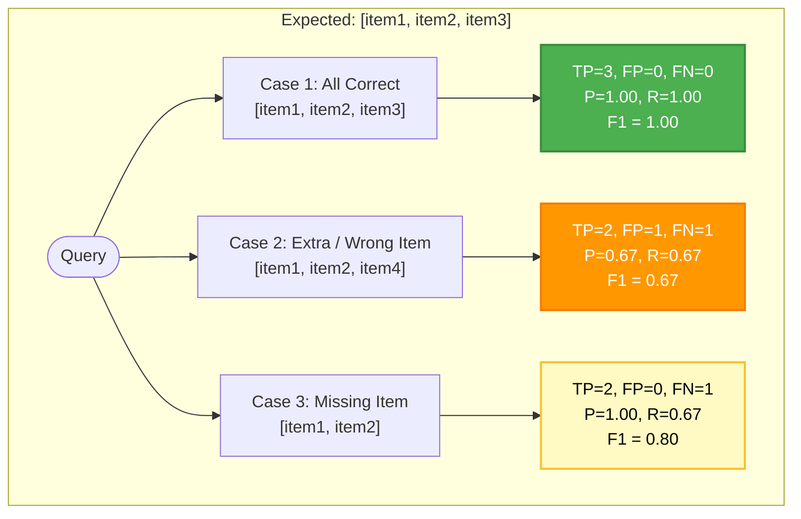
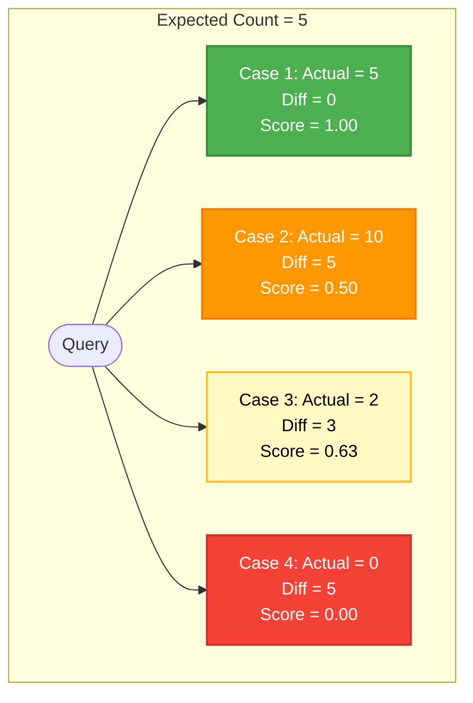
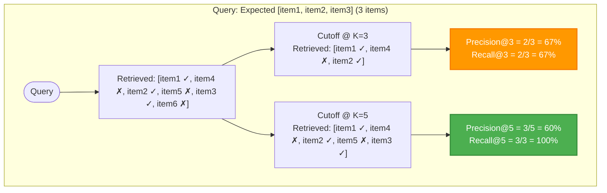
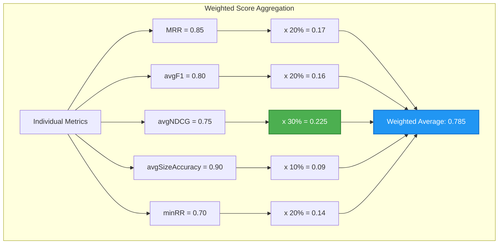
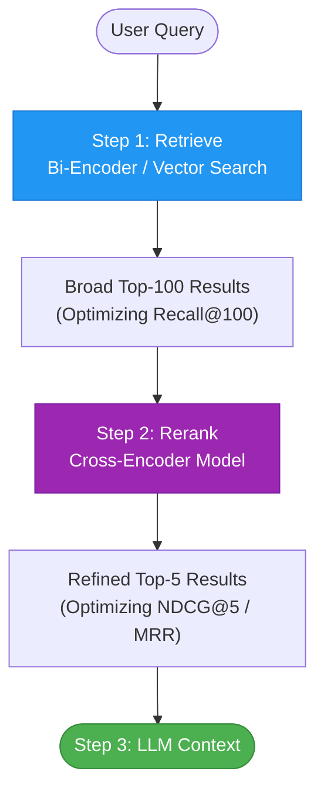

<global-bottom />

# 🥇🥈🥉 Ranking Metrics
Evaluating search quality in RAG (Retrieval Augmented Generation) or modern retrieval systems

Corentin Lallier

---
layout: center
hideInToc: true
---

# Table of Content

<Toc maxDepth="1"/>

---
layout: section
---

# Introduction: The Ranking Challenge

---
layout: two-cols-header
---

## Why is Evaluating Search & Ranking Hard?

::left::

::Card{title="Multidimensional Comparisons" color="important"}
* **Multiple Ways to Evaluate**: Comparing two lists cannot be reduced to a single perspective:
  * Do we care most about the **first relevant result**?
  * Do we care about the **entire sorted order**?
  * Do we care about **precision vs. recall** of the retrieved set?
* **Pros & Cons**: Each metric targets a specific aspect of the user experience.
::

::right::

::Card{title="Dynamic & Subjective Ground Truth" color="warning"}
* **No Perfect Ground Truth**: User expectations are subjective. Different users seeking the same query might expect different result sequences.
* **Temporal Drift**: Relevant documents and user preferences evolve over time.
* **Conflicting Trade-offs**: Optimizing for one aspect (e.g., getting the top item perfect) often sacrifices other metrics (e.g., overall recall).
::

---
layout: two-cols-header
---

## Real-World Examples: Matching Metrics to Use Cases

::left::

::Card{title="Case A: Navigational & Fact-Checking" color="success"}
* **Goal**: Find *one specific* target document (e.g., *"reset password"* or *"support email"*).
* **Metric**: **MRR** (Mean Reciprocal Rank).
* **Why**: The user only needs the top result to be correct. A correct item at rank 10 is almost useless (RR = 0.1).
::

::Card{title="Case B: Exploratory & Informational" color="note"}
* **Goal**: Get a comprehensive overview (e.g., *"machine learning frameworks"*).
* **Metric**: **NDCG & F1**.
* **Why**: The user wants a diverse, high-quality set, and the ordering of multiple items matters.
::

::right::

::Card{title="Temporal Drift & Feedback Loops" color="warning"}
* **Dynamic Ground Truth**: For queries like *"elections"* or *"market news"*, relevance changes hourly.
* **Evaluation**: Expectation lists must be updated continuously using search log clicks and user signals as proxy labels.
::

---
layout: section
---

# Mean Reciprocal Rank (MRR)

---
layout: two-cols-header
---

## Mean Reciprocal Rank (MRR)

Focus on First Relevant Result

::left::

::right::

::Card{title="Key Concepts" color="important"}
* **First Relevant Item**: MRR only cares about where the *first* relevant result appears.
* **Reciprocal Rank (RR)**: For a single query:
  $$\text{RR} = \frac{1}{\text{rank of first relevant item}}$$
* **Mean Reciprocal Rank (MRR)**: Average RR over a set of queries $Q$:
  $$\text{MRR} = \frac{1}{|Q|}\sum_{q=1}^{|Q|} \text{RR}_q$$
* **Ranges from 0 to 1**: Closer to 1 is better.
* **Heavy late penalty**: Finding the first relevant item at rank 10 yields an RR of only 0.1.
::

---
layout: section
---

# Normalized Discounted Cumulative Gain (NDCG)

---
layout: two-cols-header
---

## NDCG: Graded Relevance with Logarithmic Discount

::left::

::right::

::Card{title="Key Concepts" color="important"}
* **Considers All Positions**: Unlike MRR, NDCG evaluates the quality of the entire list.
* **Graded Relevance**: Documents can have varying relevance levels (e.g. 0 to 3).
* **Discounted Cumulative Gain (DCG)**:
  $$\text{DCG}_p = \sum_{i=1}^p \frac{\text{rel}_i}{\log_2(i+1)}$$
* **Normalized (NDCG)**: Divides DCG by the Ideal DCG (IDCG - the best possible ranking order):
  $$\text{NDCG}_p = \frac{\text{DCG}_p}{\text{IDCG}_p}$$
::

---
layout: section
---

# Mean Average Precision (MAP)

---
layout: two-cols-header
---

## Mean Average Precision (MAP): Order-Aware Binary Relevance

::left::

::right::

::Card{title="Key Concepts" color="important"}
* **Binary Relevance**: Items are either relevant (1) or irrelevant (0).
* **Average Precision (AP)**: For a single query:
  $$\text{AP} = \frac{1}{\text{No. of relevant items}} \sum_{k=1}^n P(k) \times rel(k)$$
  Where $P(k)$ is Precision@$k$, and $rel(k)$ is 1 if document at rank $k$ is relevant, 0 otherwise.
* **Mean Average Precision (MAP)**: Average AP over a set of queries $Q$:
  $$\text{MAP} = \frac{1}{|Q|} \sum_{q=1}^{|Q|} \text{AP}_q$$
* **Best For**: Systems retrieving *multiple* binary-relevant items where ranking order of all items is critical.
::

---
layout: section
---

# F1 Score

---
layout: two-cols-header
---

## F1 Score: Harmonic Mean of Precision and Recall

::left::

| Expected / Predicted | In Results | Not in Results |
|:---|:---:|:---:|
| **Expected** | **TP** (True Positive) Correctly found | **FN** (False Negative) Missed |
| **Not Expected** | **FP** (False Positive) Incorrectly included | **TN** (True Negative) N/A in Search |

* **Precision** = $\frac{\text{TP}}{\text{TP} + \text{FP}}$ (Quality of results)
* **Recall** = $\frac{\text{TP}}{\text{TP} + \text{FN}}$ (Completeness of retrieval)
* **F1 Score** = $2 \times \frac{\text{Precision} \times \text{Recall}}{\text{Precision} + \text{Recall}}$

::right::

---
layout: section
---

# Size Accuracy

---
layout: two-cols-header
---

## Size Accuracy: Penalizing Mismatch in Result Counts

::left::

::right::

::Card{title="Key Concepts" color="important"}
* **Goal**: Measures how closely the quantity of returned results matches expectations.
* **Normalized Difference**:
  $$\text{diff}_{\text{norm}} = \frac{|\text{expected} - \text{actual}|}{\max(\text{expected}, 1)}$$
* **Formula**:
  $$\text{Score} = \frac{1}{1 + \text{diff}_{\text{norm}}}$$
* **Special Rule**: If $\text{expected} > 0$ and $\text{actual} = 0$ (or vice versa), score is strictly **0.0**.
::

---
layout: section
---

# Bounding Metrics: Bounded @K

---
layout: two-cols-header
---

## Evaluating with Bounded Cutoffs: Precision@K & Recall@K

::left::

::right::

::Card{title="Why Bounding @K Matters" color="warning"}
* **Real-World Limits**: Users rarely scroll past the first 5 or 10 search results. Bounding evaluates what the user actually sees.
* **Recall@K Trade-off**: As $K$ increases, Recall increases (more chance to find relevant items), but Precision usually decreases (more irrelevant items are returned).
* **RAG Prompt Constraints**: Bounding at $K$ is vital for RAG since LLM context windows are limited and larger prompts increase cost and latency.
::

---
layout: section
---

# Combined Metric (Weighted Average)

---
layout: two-cols-header
---

## Combined Metric: Holistic Evaluation

::left::

::right::

::Card{title="Key Concepts" color="important"}
* **Holistic Score**: Aggregates all aspects of ranking, recall, size, and worst-case performance into a single number.
* **Weight Distribution**:
  * **avgNDCG** (30%): Most important (ranking order).
  * **MRR** (20%): Importance of top result.
  * **avgF1** (20%): Precision & recall.
  * **minRR** (20%): Worst-case query check (guards against tail failures).
  * **avgSizeAccuracy** (10%): Size correctness.
* **Formula**:
  $$\text{Score} = 0.3\text{NDCG} + 0.2\text{MRR} + 0.2\text{F1} + 0.2\text{minRR} + 0.1\text{Size}$$
::

---
layout: section
---

# Production Strategy: Retrieve & Rerank

---
layout: two-cols-header
---

## Production RAG Pipelines: Retrieve & Rerank

::left::

::right::

::Card{title="Optimizing the Search Funnel" color="success"}
* **Step 1: Retrieval (Vector / Hybrid)**
  * **Goal**: High **Recall** (don't miss anything relevant).
  * **Scale**: Millions of docs $\to$ Top 50-100 candidates.
  * **Speed**: Extremely fast (milliseconds).
* **Step 2: Reranking (Cross-Encoder)**
  * **Goal**: High **NDCG / MRR** (push the most relevant documents to the top).
  * **Scale**: Top 100 candidates $\to$ Top 5-10.
  * **Speed**: Slower (deep transformer attention model checking all query-doc words simultaneously).
::
