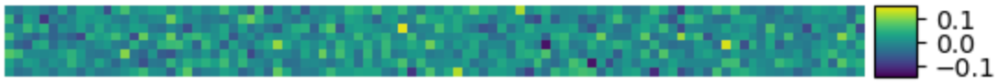
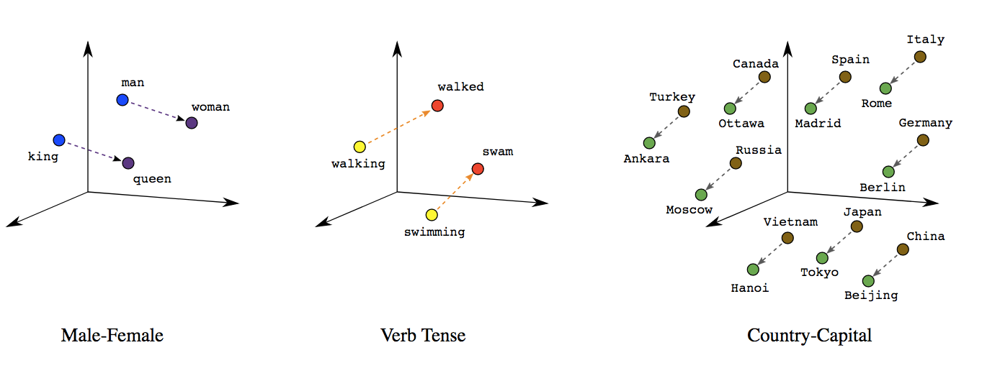

# Vector Search & Embeddings 101 🔍
An introduction to vector databases and embeddings

<div class="author-block">
  Corentin Lallier
</div>

---
layout: center
class: plan-slide
---

# Plan

1. **Vector Search vs. Keyword/Fuzzy Search**
2. **Embeddings & Sentence Transformers**
3. **Vector Databases & SDK Demos**

---
layout: section
---

# 1. Vector Search vs. Keyword/Fuzzy Search

---
layout: two-cols-header
---

# 1.1 Search 101

::left::

<QKV class="h-full max-h-80 w-full" />

::right::

For a search engine we need 3 functions:

- $f_1(x)$: A value to key function (often pre-computed)
- $f_2(x)$: A text to query function
- $f_3(x)$: A _"ranking"_ function

::div{.callout-amber.p-4.mt-10}
**A universal challenge:** Shared by Wikipedia, Google, Spotify, and any modern retrieval system.
::

---
layout: two-cols-header
---

# 1.2 Keyword and Fuzzy Search

::left::

<QKVInvertedIdx class="h-full max-h-80 w-full" />

::right::

- **$f_1(x)$ (Index creation):** Extracts keywords/stems (tokenization) and calculates TF-IDF/BM25 weights to build the inverted index.
- **$f_2(x)$ (Query parsing):** Tokenizes the query text into terms.
- **$f_3(x)$ (Comparison & Ranking):** Computes match scores using exact keyword matching, Jaccard similarity, or Levenshtein distance (for fuzzy search).

::div{.callout-amber.p-4.mt-10}

**Limitations:** 
- Searching multiple words requires complex set union/intersection operations.
- **Language is complex:** synonyms, word variations (tense, gender, plural,...), polysemy, etc.

::

---
layout: two-cols-header
---

# 1.3 Vector Search

::left::

<QKVSemanticSearch class="h-full max-h-80 w-full" />

::right::


- $f_1(x)$ and $f_2(x)$ are the **same**: a neural network that computes high-dimensional embeddings from strings.

::div{.callout-amber.p-4.mb-10} 
Don't worry! We will dive deep into this in the next section!
::

- $f_3(x)$ is a similarity function. 

The most used in practice is the **cosine similarity**:

$$ \text{similarity} = \cos(\theta) = \frac{\vec{A} \cdot \vec{B}}{\|\vec{A}\| \|\vec{B}\|} $$


---
layout: section
---

# 2. Embeddings & Sentence Transformers

---
layout: two-cols-header
---

# 2.1 What is an embedding?

::left::

- Feature vector **extracted** from a neural network model to **represent input data**.
- Can represent words, sentences, documents, images, etc.
- Captures relationships between input data (**representational learning**).

::div{.callout-amber.p-4.mb-10}

**Example:** VirusTotal - Scan IP to get report:

Vector representation:

```python
[[-7.5007e-03, 7.8518e-02, -4.0632e-02, -4.3306e-03, 3.3827e-02, ...]]
```

Image representation:



::

::right::

Embeddings in 3 mins:
::youtube{id="ulD7IsecPbU"}

---
layout: two-cols-header
---

# 2.2 Representational Learning: Example with Words

::left::

- Built with **Word2Vec** models: each vector (point) is a word embedding.
- **Closeness** $\rightarrow$ **similar embeddings** (semantic proximity $\rightarrow$ geometric proximity).
- Distance between points represents **similarity** and **relations**.
- They are **contextual**: their meaning depends on the context.

::right::

{.w-full.rounded.shadow}


---
layout: default
---

# 2.3 Vector Similarities


---
layout: default
---

# 2.4 Interactive Similarity Graph

<iframe src="./similarities.html" class="w-full h-8/10 rounded shadow" />

Zoom/Pan/Interact with the Similarity Graph. 120 descriptions. Edges are drawn if similarity &gt; 0.78.
<a href="./similarities.html" target="_blank" class="btn-blue">Open fullscreen</a>

---
layout: two-cols-header
---

# 2.5 The Baseline: What is BERT?

::left:: 

- **Bidirectional Encoder Representations from Transformers** (_Devlin et al. Google, 2018_)
- **Seq2vec model:** English sentences $\rightarrow$ vector of 768 values.
- **Training Corpus:** **2.5B** words from Wikipedia + **0.8B** words from BooksCorpus.
- **Bidirectional:** uses both left and right context (context length: 512).
- **BERT Large:** 340M parameters, trained on 64 TPUs over 4 days.

::right::

In reality, a stack of models:
$$\text{Tokenizer} \rightarrow \text{WordPiece} \rightarrow \text{BERT}$$

```js 
// e.g. tokenizer
nltk.word_tokenize("At eight o'clock on Thursday morning 
                    Arthur didn't feel very good.")
// ['At', 'eight', "o'clock", 'on', 'Thursday',
//  'morning', 'Arthur', 'did', "n't", 'feel',
//  'very', 'good', '.']
```
<a href="https://huggingface.co/blog/bert-101" target="_blank" class="btn-blue mt-10">🤗 BERT 101 on Hugging Face</a>


---
layout: center
---

# 2.6 From BERT to Sentence Transformers


- **BERT Limitation:** Vanilla BERT yields poor sentence embeddings directly (requires fine-tuning or pooling).

- **Sentence Transformers (2019-Present):**
  - Fine-tuned using **Siamese network structures** specifically for semantic similarity tasks.
  - Example: `all-mpnet-base-v2`, `BGE`, `E5`, etc.

- **API-based Embeddings today:**
  - OpenAI (`text-embedding-3-small`), Cohere Embed, Voyage AI.
  - Return high-quality, dense vectors with minimal setup.


<a href="https://huggingface.co/sentence-transformers" target="_blank" class="btn-blue mt-10">
  🤗 Hugging Face Sentence Transformers
</a>

---
layout: section
---

# 3. Vector Databases & SDK Demos

---
layout: two-cols-header
---

# 3.1 Vector Databases & Pinecone

::left::

- **Store & Index:** High-dimensional embeddings.
- **Query & Similarity:** Compare query vectors using Cosine distance.
- **Retrieve:** Return top-k closest matches to augment LLM context.
- **Popular options**: `Pinecone`, `Qdrant`, `Milvus`, `ChromaDB`, `PGVector`, `Weaviate`.

::right::

Pinecone interface example:


---
layout: center
---

# 3.2 Demo: Compute embeddings

```python
from sentence_transformers import SentenceTransformer

# load model
model = SentenceTransformer('BAAI/bge-base-en-v1.5')

# create a single embedding
embedding = model.encode([
  "Google Apigee API - Lists all developers in an organization"
], normalize_embeddings=True)
# embedding shape: [1, 768], value:
# [[-7.5007e-03,  7.8518e-02, -4.0632e-02, -4.3306e-03,  3.3827e-02,
#   -1.4586e-02,  6.2572e-02, -1.6180e-02,  6.8144e-02,  ...]]
```

---
layout: two-cols-header
---

# 3.3 Demo: Pinecone - Fill the DB

::left::

## 1. Create Index

```python
from pinecone import (
  Pinecone, ServerlessSpec
)
pc = Pinecone()

# create serverless index
pc.create_index(
  name='operations-id',
  dimension=768,
  metric='cosine',
  spec=ServerlessSpec(
    cloud='aws',
    region='us-east-1'
  )
)
```

::right::

## 2. Upsert Data

```python
index = pc.Index('operations-id')

# format: (id, vector, metadata)
vectors = [
  (
    op.id,
    op.embedding,
    {
      "service": op.serviceName,
      "description": op.description
    }
  )
  for op in operations
]
index.upsert(vectors=vectors)
```

---
layout: two-cols-header
---

# 3.4 Demo: Pinecone - Query against an embedding

::left::

## 3. Create the query embedding

```js
import { Pinecone } from
  "@pinecone-database/pinecone";

const pc = new Pinecone({
  apiKey: process.env.PINECONE_API_KEY
});
const index = pc.index("operations-id");

// embed search string
const vector = await getEmbedding(
  "Microsoft Teams - send a message"
);
```

::right::

## 4. Search & Response

```js
const response = await index.query({
  vector,
  topK: 3,
  includeMetadata: true,
});
// Results:
// 0.74: ('OPER-93a0', 'MS Teams', 'Send...')
// 0.69: ('OPER-9f59', 'MS Teams', 'Start...')
// 0.68: ('OPER-0d0e', 'MS Teams', 'Get...')
```


---
layout: center
class: text-center
---

# Thanks! 🚀

<br>
<br>

<a href="/blog/presentations/" class="btn-blue">Back to Presentations</a>

